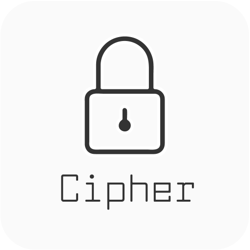

# Cipher - Remember your password safely

Everyone needs to remember lots of passwords. 
We tends to use easy passwords as it is hard to remember complicated passwords. 
However,it is not that safe when compared to complicated passwords. 
In the meantime, safety also brings us risk. A lot of incidents are related to passwords leaking.

The App *Cipher*  can help you reduce the burden of remember passwords .It gives you a new way to turn a simple concept into a complex password.

At the same time, the app does not save any password or connect to the Internet.
The algorithm of generating passwords is not possible to reverse.
It is only a MEMORING tool which provides the maximum password safety.

Support me : 

Source Code: [https://github.com/voidful/Cipher](https://github.com/voidful/Cipher)

Website: [https://voidful.github.io/Cipher](https://voidful.github.io/Cipher)

## Features

- By combining combination of pictures and words, passwords are generated.
- It has a variety of password generating method. You will always find one suit your needs.
- No ads, Internet. Only the necessary rights. The most safety.
- Nothing will be store on the phone. The Password will only in your mind which defends all outside hackings.
- User-friendly Design 
- Easy to use.
- many more ...

## Get the App

## Screenshots

### Start Page

### Double Verification. 

### Generate Page   
  

## Privacy Policy

### Personal information.

Personal information is data that can be used to uniquely identify or contact a single person. I DO NOT collect, transmit, store or use any personal information while you use this app.

### Non-Personal information.

I DO NOT collect non-personal information like user's behavior:

 -  to solve App problems
 -  to show personalized ads

The google play store collect non-personal information such as the data of install (country and equipment).

### Privacy Questions.

If you have any questions or concerns about my Privacy Policy or data processing, please contact me.
